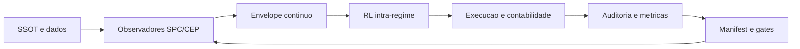

## MASTERPLAN V2 — CEP_BUNDLE_CORE (minuta completa para crítica)

### 1. Visão e princípio de projeto

Construir um bundle operacional orientado por evidências, no qual o núcleo é controle estatístico (SPC/CEP) e governança de execução (Agno, gates, manifests), com rastreabilidade ponta a ponta por `report.md`, `manifest.json`, `evidence/` e hashes.

Este V2 preserva o baseline do bundle (M3) como referência do “core” de ranking, mas muda a camada decisória para eliminar o padrão de deriva longa em regime adverso (W2-like) sem cair em bloqueio operacional.

---

### 2. Objetivo total (SSOT) e definição de sucesso

Objetivo total: maximizar robustez em janelas adversas (W2-like) sem bloquear indevidamente a capacidade de operação em regimes favoráveis, mantendo a hierarquia: SPC/CEP governa regime; RL atua apenas na priorização intra-regime.

Definição operacional de sucesso (o que precisa ser verdade ao final do V2):

1. Robustez W2-like melhora contra o baseline M3 sob a mesma contabilidade (custo + caixa remunerado a CDI), com queda relevante no comportamento de deriva longa (tempo underwater e drawdown), e redução do turnover trap em estresse.

2. Capacidade de captura em regimes favoráveis é preservada, sem bloqueio operacional por regras excessivas.

3. A política SPC/CEP↔RL é auditável por execução: fica impossível produzir um run “NEW ≈ M3” sem evidência clara de que o envelope contínuo e os guardrails foram consumidos e aplicados.

---

### 3. Baseline do bundle: M3 (fixo)

O baseline de estratégia do bundle permanece M3, incluindo a fórmula de referência do corpus legado: `score_m3 = z(score_m0) + z(ret_lookback_62) - z(vol_lookback_62)`. O V2 não altera esse núcleo sem governança formal; ele o envolve com uma camada de decisão contínua e controles anti-deriva.

---

### 4. Definições de marcação, caixa e execução (normas do V2)

#### 4.1 Marcação a mercado e marcação a carteira

* Marcação a mercado: variação diária das posições e do caixa, com decomposição de P&L por ativo e agregado.
* Marcação a carteira (NAV operacional): equity agregada, usada para avaliação e reward, mas nunca como único sensor; o sistema precisa enxergar também deriva, drawdown, turnover, cash_ratio e sinais CEP/SPC (burners e carteira).

Essas duas marcações alimentam observadores e auditoria; o objetivo é impedir que o sistema “pareça bom” em bull e fique cego em estresse.

#### 4.2 Regra de caixa (invariante)

Regra do V2: compra só ocorre com dinheiro em caixa. Para comprar é necessário haver caixa disponível; o caixa aumenta por vendas (ou por saldo já existente) e rende CDI quando parado. Esta regra é estrutural: ela governa a execução e precisa constar nos artefatos de auditoria (ledger e daily_portfolio).

Liquidação operacional atual: sem sofisticação de espera; vendeu, baixou o ativo e o valor líquido entra no caixa no mesmo passo (T+0 operacional).

#### 4.3 Custos e remuneração do caixa (normas contábeis do bundle)

* Custo de operação: 0,025% do valor do trade (0,00025 × valor do trade) aplicado em BUY e SELL no momento do trade.
* Remuneração do caixa: saldo diário de caixa rende CDI, conforme SSOT de CDI e metodologia reprodutível já aplicada no baseline de métricas v5.

#### 4.4 Cadência de compra

Compras são executadas apenas a cada 3 sessões. O RL pode produzir intenções diariamente, mas a execução materializa BUY somente nas sessões elegíveis. Vendas (especialmente proteção total) não são restringidas por essa cadência.

---

### 5. Arquitetura decisória: envelope contínuo e hierarquia SPC/CEP↔RL

#### 5.1 Entrada de sinais (multi-origem)

O V2 adota explicitamente que a decisão (especialmente compra e rebalanceamento) deve ser guiada por métricas de diversas origens, não apenas “mercado” ou apenas “CEP”, incluindo:

* contexto de mercado amplo (ex.: B3 e referência externa como S&P500),
* estado da carteira (equity, drawdown, tempo underwater, cash_ratio, turnover),
* burners por ativo (stress, amplitude, tendência),
* CDI (custo de oportunidade do caixa),
* um conjunto pequeno e governado de indicadores técnicos para ações e BDRs.

O objetivo é transformar o “estado do mundo” num contínuo em [0,1] em vez de uma máquina discreta de 5 estados.

#### 5.2 SPC/CEP como camada estruturante (envelope contínuo)

O papel de SPC/CEP permanece o definido no SSOT: definir regime e permissão de operação em burners e carteira.
A implementação V2 formaliza “regime” como envelope contínuo, composto por limites e penalidades que moldam o espaço de ação do RL.

Guardrails anti-deriva (normativos, vindos do pacote W2):

* Histerese por drawdown: `dd_on=-0.2`, `dd_off=-0.1`.
* Teto de turnover por regime: W1=0.22, W2=0.12, W3=0.15, OTHER=0.16.
* Anti-reentry: multiplicador de stress 0.8 + regra de fallback conservador até janela de recuperação.

O pacote anti-deriva W2 selecionou objetivamente como camada incremental com melhor ganho em W2 o E4 (anti-reentry filter), acima de E3 (histerese) e E2 (turnover cap). O V2 incorpora E4 como mecanismo central, mantendo E2 e E3 como guardrails do envelope.

#### 5.3 RL (camada intra-regime, controle contínuo)

O RL atua apenas intra-regime, subordinado ao envelope SPC/CEP, com a regra de rejeição: qualquer ganho do RL que degrade robustez W2 deve ser rejeitado.

No V2, o RL controla variáveis contínuas em [0,1] e produz priorizações de execução:

* intensidade de risco/exposição agregada em [0,1] (sujeita a caixa, guardrails e fallback),
* priorização de SELL complementar (não proteção total),
* priorização de BUY (candidatos), sujeita à cadência de 3 sessões e ao orçamento estrito de caixa.

Venda por proteção total do ativo permanece fora do RL (override determinístico).

---

### 6. Mecanismos de controle por tipo de ação (venda e compra)

#### 6.1 Venda

Camada 1 (determinística): proteção total por ativo via burners/SPC/CEP, executável em qualquer sessão.
Camada 2 (RL): venda complementar para ajuste de risco/rotatividade dentro do envelope (respeitando turnover cap).
Custos: aplicar 0,025% no valor de cada SELL, reduzindo o crédito líquido de caixa.

#### 6.2 Compra

Gate estrutural: só compra com caixa disponível.
Cadência: BUY apenas em sessões elegíveis (cada 3 sessões).
Camada SPC/CEP: limita agressividade (envelope) e aplica penalidade anti-reentry e fallback quando aplicável.
Camada RL: prioriza candidatos e define intensidade de alocação dentro do orçamento de caixa e limites de turnover.

---

### 7. Métricas perseguidas (por janela e por execução)

As métricas mínimas seguem o plano de validação do bundle, com explicitação do problema “deriva longa”:

Métricas primárias (por full/W1/W2/W3):

* retorno acumulado,
* multiple líquido com custos e caixa remunerado a CDI (metodologia v5),
* MDD,
* tempo underwater e tempo de recuperação,
* turnover,
* cash_ratio,
* número de posições.

Métricas de auditoria/forense:

* trilha diária de regime (envelope) e seus limites ativos,
* registros de disparo de fallback,
* incidência de anti-reentry (quando bloqueou/penalizou reentrada),
* decomposição de contribuição por ticker/setor.

---

### 8. Plano por fases (objetivos por fase, entregas e fundamentação prática)

#### Fase 0 — SSOT e governança do V2 (documental e operacional)

Objetivo: consolidar o MASTERPLAN V2 como SSOT, preservando baseline M3 e tornando explícitas as normas de caixa/custos/CDI/cadência de compra.
Entregas: `docs/MASTERPLAN_V2.md`, atualização de índices locais e pacote de referência (hashes).
Fundamentação: o bundle exige rastreabilidade por report/manifest/evidence.

#### Fase 1 — Observabilidade e contabilidade reprodutível (sem ambiguidade)

Objetivo: garantir que ledger, daily_portfolio e cálculo (custos + CDI) estão corretos e auditáveis para M3 e para qualquer run V2.
Entregas: validações automáticas e plots Plotly de decomposição; critérios de integridade (caixa, custos, nav).
Fundamentação: o report v5 ancorou metodologia com CDI SSOT e custos; isso vira baseline obrigatório.

#### Fase 2 — Envelope contínuo SPC/CEP + executor (caixa e cadência)

Objetivo: implementar o envelope contínuo e os guardrails como limites do espaço de ação, com executor respeitando: (i) venda proteção total imediata, (ii) compra somente com caixa, (iii) buy a cada 3 sessões.
Entregas: trilhas diárias do envelope; auditoria de enforcement de turnover cap/histerese/anti-reentry; plots Plotly.
Fundamentação: pacote anti-deriva W2 define parâmetros e seleciona E4 como melhor ganho em W2.

#### Fase 3 — Revalidação ablation E1–E5 no V2 (causalidade e não-regressão)

Objetivo: provar incrementalmente o efeito de E2/E3/E4 dentro do V2, sob a mesma contabilidade e com auditoria completa.
Entregas: runs E1..E5 reexecutáveis, comparativos por janela e manifests com hashes.
Fundamentação: masterplan do bundle já define o ablation controlado como caminho para evolução segura.

#### Fase 4 — RL intra-regime (controle contínuo e regra de rejeição)

Objetivo: ativar o RL como priorizador contínuo (0..1) dentro do envelope, com rejeição automática de ganhos que piorem W2.
Entregas: trilha de inputs do RL, ações, decisões finais após enforcement, e critérios de rejeição.
Fundamentação: policy SPC/RL define papéis e regra de rejeição; o V2 torna isso testável.

#### Fase 5 — Fechamento de gaps do corpus e pacote final de governança

Objetivo: elevar cobertura de métricas/hashes e consolidar taxonomia de janelas/regimes, liberando evolução futura sem regressão.
Entregas: checklist de cobertura e evidências (G1–G4), pacote final de governança.

---

### 9. Diagramas (camadas e mecanismos)

#### 9.1 Camadas e mecanismos (venda e compra, com caixa e cadência)

```mermaid
flowchart TB

subgraph INPUTS[Entradas e sinais]
  I1[Mercado amplo: B3 e referencia externa]
  I2[Carteira: equity, drawdown, underwater, cash_ratio, turnover]
  I3[Burners por ativo: stress, amplitude, tendencia]
  I4[CDI: retorno diario do caixa]
  I5[M3 core: score_m3 e ranking base]
  I6[Indicadores tecnicos selecionados: acoes/BDRs]
end

subgraph OBS[SPC/CEP: envelope continuo e guardrails]
  O1[Observadores SPC/CEP (carteira + burners)]
  O2[Envelope continuo: limites e penalidades]
  O3[Histerese dd_on/dd_off]
  O4[Turnover cap por regime]
  O5[Anti-reentry + stress multiplier]
  O6[Fallback conservador ate recuperacao]
end

subgraph RL[RL: controle continuo intra-regime]
  R1[intensidade_risco in [0,1]]
  R2[prioridade SELL complementar]
  R3[prioridade BUY candidatos]
end

subgraph EXEC[Execucao]
  E0[Checa sessao elegivel de compra (cada 3 sessoes)]
  E1[SELL protecao total (override)]
  E2[Executa SELLs e aplica custo 0,025%]
  E3[Credito T+0 no caixa (liquido)]
  E4[Orcamento BUY = caixa_disponivel]
  E5[Enforce: turnover cap + anti-reentry + fallback]
  E6{Sessao elegivel?}
  E7[Executa BUYs com caixa e aplica custo 0,025%]
  E8[Saldo em caixa rende CDI]
end

subgraph AUDIT[Auditoria]
  A1[ledger + daily_portfolio]
  A2[metricas por janela: multiple, MDD, underwater, turnover, cash_ratio]
  A3[report + manifest + evidence]
end

I1 --> O1
I2 --> O1
I3 --> O1
I4 --> E8
I5 --> R3
I6 --> R3

O1 --> O2
O3 --> O2
O4 --> O2
O5 --> O2
O6 --> O2

O2 --> RL
O2 --> E1

R1 --> E5
R2 --> E2
R3 --> E7

E0 --> E1
E1 --> E2
E2 --> E3
E3 --> E4
E4 --> E5
E5 --> E6
E6 -- Sim --> E7
E6 -- Nao --> E8
E7 --> E8

E2 --> A1
E3 --> A1
E7 --> A1
E8 --> A1
A1 --> A2
A2 --> A3
```

#### 9.2 Loop de governança



