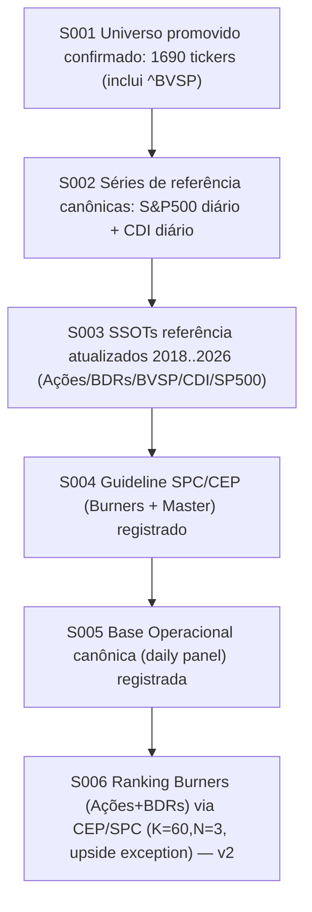

# Checklist — Estado Confirmado (Owner) — CEP_BUNDLE_CORE (Tentativa 2)

last_updated: 2026-02-22
scope: Tentativa 2 (work/ e outputs/ apenas; ssot_snapshot/ read-only)

Regra: este checklist mostra apenas o que existe como correto (confirmado e materializado). Nao listar pendencias.

