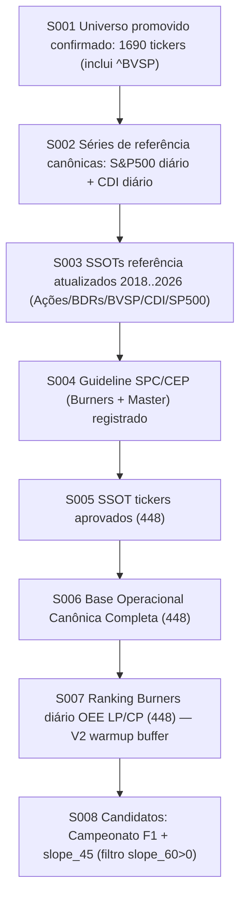

# Checklist — Estado Confirmado (Owner) — CEP_BUNDLE_CORE (Tentativa 2)

last_updated: 2026-02-23
scope: Tentativa 2 (work/ e outputs/ apenas; ssot_snapshot/ read-only)

Regra: este checklist mostra apenas o que existe como correto (confirmado e materializado). Nao listar pendencias.
Regra permanente: CTO sempre entrega O QUE/POR QUE/COMO/RESULTADO ESPERADO em linguagem natural (sem código) antes do JSON ao Agente; regras só valem se usadas desde S001 com evidência; senão vai para Crítica do Owner.

## Atualizacoes ativas de fonte (governanca)

- update_date: 2026-02-23
- S007 ACTIVE (RULEFLAGS GLOBAL 20260223): `/home/wilson/CEP_BUNDLE_CORE/_tentativa2_reexecucao_completa_20260220/outputs/state/s007_ruleflags_global/20260223/s007_ruleflags.parquet`
- S007 ACTIVE metrics: `keyspace=845824`, `tickers=448`, `full_domain_audit=PASS` (`/home/wilson/CEP_BUNDLE_CORE/_tentativa2_reexecucao_completa_20260220/outputs/governanca/audits/20260223/s007_ruleflags_fulldomain_equivalence/report.md`)
- S007 INACTIVE/DEPRECATED (preservado; proibido para consumo ativo): `/home/wilson/CEP_BUNDLE_CORE/_tentativa2_reexecucao_completa_20260220/outputs/burners_ranking_oee_lp_cp_daily_v2_warmup_buffer/ranking/burners_ranking_daily.parquet`
- justificativa: promocao para RULEFLAGS GLOBAL com equivalencia full-domain auditada e rastreabilidade formal.
