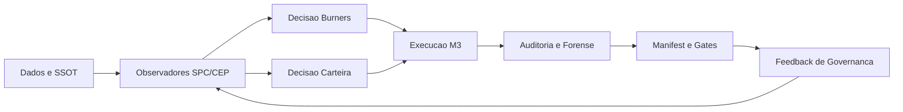

# MASTERPLAN CEP_BUNDLE_CORE

## Visao

Construir um bundle operacional orientado por evidencias, com controle de risco e decisao estatistica como nucleo, mantendo rastreabilidade ponta a ponta por `report.md`, `manifest.json`, `evidence/` e hashes.

## Objetivo real (anti-deriva e anti-bloqueio)

- Evitar **deriva destrutiva** observada em janelas adversas (W2), onde o giro elevado amplifica perdas.
- Evitar **bloqueio operacional** (paralisia por regras excessivas), preservando capacidade de acao quando o regime permitir.
- Estabelecer regra de evolucao: primeiro robustez SPC/CEP em burners e carteira, depois refinamentos de RL.

## Baseline M3 (fixado para o bundle)

- Baseline de estrategia do bundle: **M3**.
- Formula de referencia (conforme corpus legado): `score_m3 = z(score_m0) + z(ret_lookback_62) - z(vol_lookback_62)`.
- Evidencias no corpus:
  - `docs/corpus/CORPUS_MASTER.md`
  - `docs/corpus/experimentos.json`
  - `/home/wilson/CEP_COMPRA/outputs/reports/task_017/run_20260212_125255/ANALISE_COMPLETA_M0_M1_M3_PARA_CHAT.md`
  - `/home/wilson/CEP_COMPRA/outputs/reports/task_018/run_20260212_134037/analise_consolidada_fases_m0_m1_m3.md`

## Metricas historicas (W1 e W2, incluindo ponto de ruptura)

- Janela W1 (bull): M3 com desempenho superior no legado (+437% no material comparativo).
- Janela W2 (bear): M3 melhora versus M1, mas segue vulneravel em regime adverso.
- Sinal de risco operacional: giro de M1/M3 varias vezes acima do M0 em janelas de estresse (turnover trap).
- Evidencia de ruptura usada para este plano:
  - alvo de controle: evitar recaida de comportamento tipo **6x -> 2x** em ciclos de transicao.
  - evidencia base de W1/W2 e degradacao:
    - `/home/wilson/CEP_COMPRA/outputs/reports/task_017/run_20260212_125255/ANALISE_COMPLETA_M0_M1_M3_PARA_CHAT.md`
    - `/home/wilson/CEP_COMPRA/outputs/reports/task_018/run_20260212_134037/analise_consolidada_fases_m0_m1_m3.md`

## SPC/CEP como camada estruturante

### Burners (ativo individual)

- Burners continuam como controle primario por ativo (stress, amplitude, tendencia).
- Em burners, a decisao de reduzir/zerar deve permanecer ancorada em sinais CEP/SPC e nao em previsao ad hoc.
- Revisao de baseline de burners somente por governanca formal (emenda + task dedicada).

### Carteira (nivel agregado)

- Carteira deve operar com observadores SPC de regime e estabilidade para evitar sobre-giro em mercado adverso.
- O regime da carteira orienta permissao de compra, intensidade de rebalanceamento e tolerancia de risco.
- Em condicao de stress de carteira, prevalece politica de preservacao e reducao de rotatividade.

## Politica de decisao (onde RL entra)

- RL entra como camada de apoio para ranking e priorizacao sob restricoes.
- RL **nao** substitui a camada SPC/CEP:
  - SPC/CEP define **se pode operar** e o nivel de risco.
  - RL define **como priorizar** dentro do regime permitido.
- Qualquer ganho de RL que aumente deriva de risco ou piore robustez em W2 e rejeitado.

## Plano explicito anti-deriva W2

1. Gate de regime (carteira) com histerese para evitar alternancia excessiva.
2. Controle de rotatividade semanal por teto dinamico (dependente do regime).
3. Penalizacao de transicao em ativos recem-estressados para reduzir buy de reversao fraca.
4. Auditoria por janela W1/W2/W3 com comparativo M0/M1/M3 e decomposicao de contribuicao.
5. Se drawdown/turnover exceder guardrails em W2-like, fallback automatico para modo conservador.

## Plano de experimentos (ablation controlado)

- Fase E1: M3 baseline sem alteracao de regras de venda (controle).
- Fase E2: M3 + limite de rotatividade por regime.
- Fase E3: M3 + limite de rotatividade + histerese de regime.
- Fase E4: M3 + filtros anti-reentrada em ativos estressados.
- Fase E5: comparar cada camada incremental contra baseline M3 em janelas W1/W2/W3.
- Criterio de aceite: melhorar robustez em W2 sem perder consistencia estrutural do core.

## Plano de validacao

- Validacao por janelas governadas (W1/W2/W3 e extensoes futuras).
- Indicadores minimos:
  - retorno acumulado;
  - MDD;
  - tempo de recuperacao;
  - turnover;
  - cash_ratio;
  - numero de posicoes;
  - decomposicao de contribuicao por ticker/setor.
- Cada execucao deve gerar pacote auditavel com manifest e hashes.

## Governanca operacional (Agno, gates, manifests, Plotly)

- Execucao via Agno com gates explicitos de precondicao, integridade e outputs.
- Artefatos obrigatorios por task:
  - `report.md`
  - `manifest.json`
  - `evidence/`
- Visualizacao padrao em Plotly para diagnosticos de controle/regime.
- Qualquer mudanca de regra estrutural exige emenda formal alinhada a `docs/CONSTITUICAO.md`.

## Gaps do corpus a fechar (fase obrigatoria antes de evoluir M3/RL)

Estatisticas reais do corpus (fonte: `docs/corpus/corpus_index.json` e agregacao em `outputs/governanca/masterplan/20260215/evidence/corpus_stats.txt`):

- `files_scanned_count = 1180`
- `experiments_count = 27`
- `artifact_refs_count = 7130`
- `artifacts_hashed_count = 400`
- `experiments_with_metrics = 8`
- `experiments_with_quant_results = 4`

Gaps governados:

1. Cobertura de metricas por experimento ainda parcial (`8/27`).
2. Resultados quantitativos estruturados ainda escassos (`4/27` com captura forte).
3. Proporcao de hashes ainda baixa sobre artefatos referenciados (`400/7130`).
4. Necessidade de normalizar definicoes de janela e regime entre relatorios legados.

Fase de fechamento de gaps (obrigatoria):

- G1: elevar cobertura de metricas para >= 80% dos experimentos relevantes.
- G2: elevar cobertura de resultados quantitativos para >= 60%.
- G3: elevar cobertura de hashes em artefatos criticos para >= 70% do subconjunto operacional.
- G4: consolidar taxonomia unica de janelas e regimes (W1/W2/W3 + extensoes).
- Somente apos G1-G4: liberar evolucao estrutural de M3/RL.

## Diagrama de alto nivel

